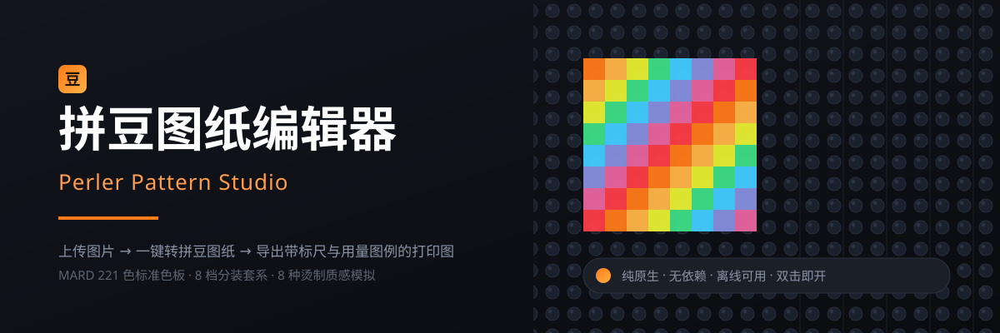
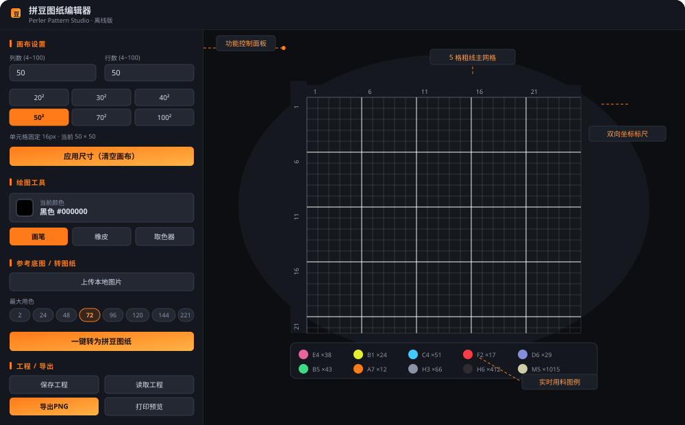
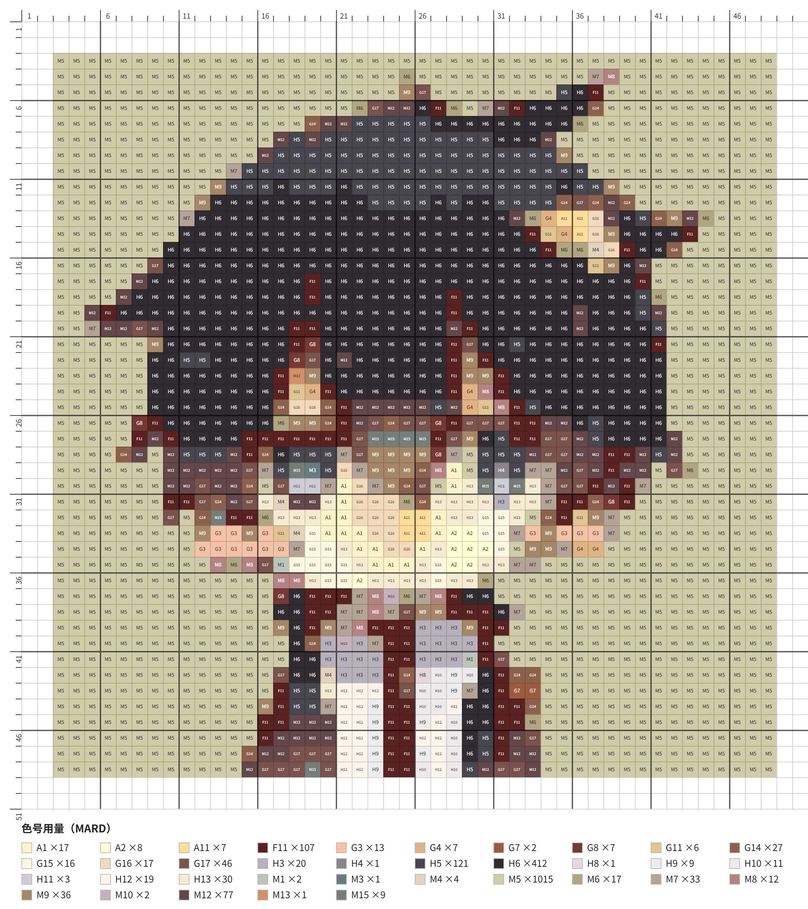

<div align="center">



# 拼豆图纸编辑器

**上传图片 → 一键转拼豆图纸 → 导出带标尺与用量图例的打印图**

一个 HTML 文件搞定。不用装软件、不用联网、没有依赖，双击就能用。

[](LICENSE)
[](#-特性)
[](#-特性)
[](#-特性)

[English](README_EN.md) · [更新日志](CHANGELOG.md)

</div>

---

## 📖 这是什么

拼豆（Perler Bead / 拼拼豆豆）玩家画图纸，常见的做法是在 Excel 里一格一格填色，或者拿手机 App 画——前者费手，后者给不了色号。这个工具把整条链路做成一件事：

**丢一张图进去，出来一张可以直接打印、照着拼的图纸。**

它会把图片按格子拆开，每格取一个代表色，再匹配到 **MARD 221 色标准色板**里的最近色号，最后导出一张自带坐标标尺和「色号用量」图例的 PNG。

<div align="center">

</div>

---

## ✨ 特性

### 🖼️ 图片转图纸

- **中值色采样**：每格取该区域像素的**中位数**而不是平均值。平均值会把相邻的异色混成一团过渡灰，中值色更能保住原本的色块边界。
- **MARD 221 色标准色板**：A 黄橙 / B 绿 / C 蓝 / D 紫 / E 粉 / F 红 / G 棕肤 / H 黑白灰 / M 莫兰迪灰，共 9 系 221 色，全部按官方色卡 HEX 录入。
- **8 档分装套系限色**：`2 / 24 / 48 / 72 / 96 / 120 / 144 / 221`，直接对应市售豆子的分装规格。选定套系后，转换只在该套系内匹配颜色——**出的图和你手里的豆子对得上**。
- **边缘留白**：0~20 格可调，留白区域自动置空，不会硬拉伸画面。
- **底图透明度**：0~100% 可调，方便边看原图边手动补细节。

### ✏️ 手动绘制

- **画笔 / 橡皮 / 取色器**三件套，拖拽连续绘制（Bresenham 直线插值，快速拖动不断点）。
- **±8 档尺寸**：4×4 到 100×100 任意行列，附 20²/30²/40²/50²/70²/100² 快捷预设。
- **色板搜索**：输入 `A1`、`M15` 之类色号即筛选，221 色里找色不用翻。
- **水平镜像 / 顺时针旋转 90°**，旋转后行列自动互换。
- **撤销 / 重做** 50 步，`Ctrl+Z` / `Ctrl+Y`。

### 🎨 烫制工艺预览

拼豆烫完之后长什么样，跟豆子本身关系很大。内置 8 种表面质感模拟：

| 工艺 | 效果 |
|---|---|
| 普通 | 无特效，纯色块 |
| 粗闪 | 大颗闪光点，颗粒感强 |
| 细闪 | 密集微闪，细腻珠光 |
| 夜光格利特 | 绿色夜光底 + 亮点 |
| 毛巾烫 | 稀疏布纹肌理 |
| 澡巾烫 | 密集布纹肌理 |
| 仙度瑞拉烫 | 斜向高光带 |
| 蒸笼布烫 | 点阵网纹 |

纹理按坐标做**确定性哈希**生成，重绘不会闪烁跳动。

### 📐 导出与打印

- **导出 PNG**：白底、带坐标标尺、图案下方自动附「色号用量（MARD）」图例，按色系字母 + 数字自然序排（`A2` 在 `A10` 前面）。
- **打印预览**：一键生成 A4 打印页并唤起打印对话框，直接出纸。
- **工程存取**：JSON 格式保存画布尺寸与全部像素数据，随时读回来接着改。

---

## 🚀 快速开始

### 方式一：直接用（推荐）

1. 下载 [`index.html`](index.html)（右键 → 另存为）；
2. 双击打开，浏览器里就能用。

就这两步。没有安装、没有注册、不联网。

### 方式二：克隆下来

```bash
git clone https://github.com/AVC459/Perler_Bead_Pattern_Editor.git
cd Perler_Bead_Pattern_Editor
# 双击 index.html，或者：
start index.html        # Windows
open index.html         # macOS
xdg-open index.html     # Linux
```

### 上手三步

```
① 上传本地图片  →  ② 选「最大用色」（比如 72）→  ③ 点「一键转为拼豆图纸」
```

觉得哪里不对，用画笔手动补两笔，然后「导出PNG」。

> **建议**：第一次用先试 `50² 画布 + 72 色`。这两个值是绝大多数拼豆作品的最优平衡点——格子够细能看出细节，72 色是市售最主流的套装之一，不用为了几个特殊色再买一整套。

---

## 📦 目录结构

```
Perler_Bead_Pattern_Editor/
├── index.html                      # 全部代码（HTML + CSS + JS），64 KB 单文件
├── example/
│   └── example-50x50.png           # 50×50 导出样例（含标尺与用量图例）
├── images/
│   ├── banner.svg                  # 顶部横幅
│   ├── ui-layout.svg               # 界面结构示意
│   ├── alipay-qr.jpg               # 赞赏收款码
│   └── wechat-qr.png               # 赞赏收款码
├── CHANGELOG.md                    # 更新日志
├── LICENSE                         # MIT
└── README.md / README_EN.md        # 中英双语说明
```

---

## 🖼️ 导出长什么样

<table>
<tr>
<td width="50%" align="center"><b>导出的图纸</b><br><sub>白底 · 坐标标尺 · 5 格粗线主网格 · 色号标注</sub></td>
<td width="50%" align="center"><b>底部色号用量图例</b><br><sub>按色系字母 + 数字自然序排列</sub></td>
</tr>
</table>



这张样例是 50×50 的成品导出图，可以看到：

- **顶部与左侧双标尺**：1 格细线、5 格粗线并标数字，拼的时候直接数格子；
- **每格印着色号**（如 `H6`、`M5`、`F11`），照着色号拿豆子，不用靠眼睛比颜色；
- **底部用量表**：`M5 ×1015`、`H6 ×412` 这样列出来，买豆子前先算好要几包。

---

## ❓ 常见问题

<details>
<summary><b>色号为什么是 MARD 而不是别的品牌？</b></summary>

MARD 是国内拼豆圈流通最广的色卡体系，色号（A1、H7、M5 这类）在淘宝买豆子时能直接对上。别的品牌色号体系不同，用之前先对照一下自己的色卡。
</details>

<details>
<summary><b>「最大用色」该怎么选？</b></summary>

按你**手上有的豆子**选。数字对应市售分装规格：

| 档位 | 含义 |
|---|---|
| 2 | 黑白双色（H7 + H1） |
| 24 / 48 / 72 / 96 | 板块① 起逐块叠加，适合入门到进阶 |
| 120 / 144 | A~E 加第六板块，覆盖大部分配色需求 |
| 221 | 全套 221 色，色彩最还原 |

选小了颜色会失真，选大了会出现你手里没有的色号。**按手上的豆子选，不要按图片选。**
</details>

<details>
<summary><b>图片转出来的结果色块糊成一团怎么办？</b></summary>

三个办法，按优先级：

1. **换图**。拼豆图纸最小颗粒就是 1 格，原图主体太小或线条太细，转出来必然糊。建议主体占画面 60% 以上。
2. **加大画布**。50² 换成 70² 或 100²，同样内容用更多格子表达。
3. **提高用色档位**。24 色转照片会丢色严重，换成 72 或 96。
</details>

<details>
<summary><b>能处理多大的画布？会不会卡？</b></summary>

上限 100×100 = 10000 格。转换过程是逐格采样 + 遍历候选色板匹配，100² 在普通电脑上大约 1~2 秒。绘制与渲染用双层 Canvas，只重绘变化图层，画满也不会卡。
</details>

<details>
<summary><b>数据会上传到服务器吗？</b></summary>

不会。这个工具没有任何网络请求代码，图片只在你本地浏览器的 Canvas 里处理，断网也能完整使用。可以直接看源码确认。
</details>

---

## 🛠️ 技术实现

单文件，原生 HTML + CSS + JavaScript，零依赖、零构建。

| 模块 | 实现要点 |
|---|---|
| 画布 | 双层 Canvas：底层放参考底图，上层放像素图纸；按 `devicePixelRatio` 放大内部缓冲（上限 2×），既清晰又不吃性能 |
| 标尺 | 独立的 2 个 Canvas 按绝对定位精确对齐，与画布共用同一套 `CELL` 常量，保证像素级同步 |
| 绘制 | `mousedown/mousemove/mouseup` + 触摸事件；Bresenham 插值补齐快速拖拽的中间格 |
| 采样 | 每格约 10×10 子采样，逐通道排序取中位数；跳过 alpha < 10 的透明像素 |
| 匹配 | RGB 欧式距离遍历候选色板求最近色；候选集由所选套系预先筛出，避免全量 221 次比较 |
| 纹理 | 确定性哈希 `hash(x, y) → [0,1)` 决定闪光点位置，重绘结果稳定不闪 |
| 导出 | 离屏 Canvas 按 22px/格 放大重绘，白底 + 标尺 + 图例排版后 `toDataURL` 输出 |
| 历史 | 网格二维数组整体深拷贝入栈，上限 50 步 |

代码结构在 `index.html` 顶部有注释索引，按注释分块阅读即可。

---

## 🤝 贡献

欢迎提 Issue 和 PR。比较想收的方向：

- 更多品牌色卡（Hama / Artkal / 漫漫 等）支持；
- 从图纸反向识别（传照片 → 出网格数据）；
- 分区域导出（大图纸切片打印，拼好再拼起来）。

提之前先开个 Issue 聊聊，避免白做工。

---

## 📄 License

[MIT](LICENSE) —— 随便用，商用也行，改完不用告诉我。

---

## 赞赏

这个工具从头到尾就一个 HTML 文件，没有服务器、没有广告、也不打算收费。它帮我把「画一张拼豆图纸」这件事从两小时压到了两分钟——如果它对你也管用，可以请我喝杯咖啡。**完全随意，不请也照样用，功能一个不少。**

<table align="center">
  <tr>
    <td align="center" width="240"><br><b>支付宝</b></td>
    <td align="center" width="240"><br><b>微信</b></td>
  </tr>
</table>
